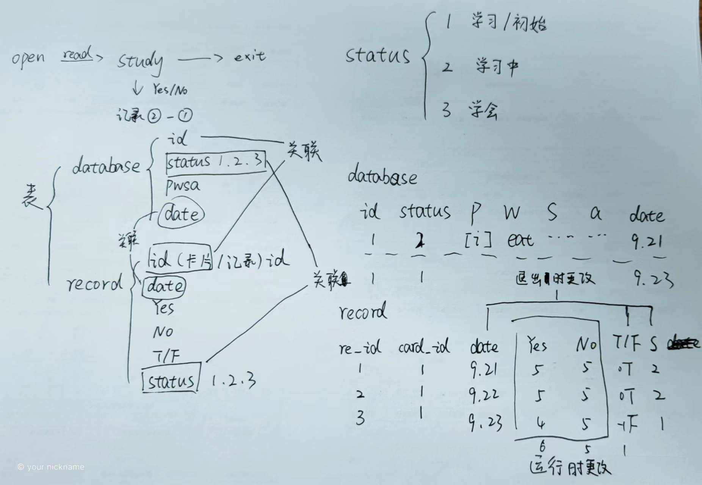

# flashlang_learn

**开发日志（第一周）**

## 2023.9.4
- 设置了两个按键y/n
   - 按y表示知道单词，那么就删除这个单词在列表里，下次就不会出现

## 2023.9.5 
- 设置了三个按键l/r/f，代表不同状态
    - 初始状态为0
    - 按键l（1，学习）
    - 按键r（2，复习）
    - 按键f（3，学会）

根据不同状态来判断学习程度

- 记录学习次数

## 2023.9.6
- 添加了音频文件 
- 添加了音标播放功能

## 2023.9.7
- 设置退出键
   - 退出程序
   - 保存当前状态（还没实现）
- 音频播放完成后才进行下一步
- 解决了CSV文件转换为db文件时有些内容乱码的情况（utf-8）

## 2023.9.8
- 状态0和状态1有区别吗？没有就删除
- 程序的流程图初版
- 数据库数据解释初版设想

**开发日志（第二周）**

## 2023.9.11
- 音标学习卡片音频完整版
- 考虑了不同的学习情况
- 将每次学习和复习次数都记录下
- 用第三个总和列来判断是否归零
- 学习和复习列次数超过一定数量要处理

## 2023.9.12
- 将学习状态，学习和复习次数，和日期结合
- 用表格的形式记录

## 2023.9.13
- 数据库待改进版
- 表格可能会是这样

| Date | Status | Learn | Review | Total |
|:----------:|:----------:|:----------:|:----------:|:----------:|
|  9.12      |      1      |       5     |        3    |        F    |

## 2023.9.14

- 学习时会产生不同状态的数据表（学习/学会）
- 这些表格通过id联系到一起

**开发日志（第三周）**
## 2023.9.19

- 需要的表格
  - 卡片记录表
  - 学习记录表
  - 完全学会卡片表

## 2023.9.20

- 用户选择键
  - yes（知道）
  - no（不知道）
  - q（退出）

- 表格
  - 卡片记录表
  - 学习记录表
  - ~~完全学会卡片表~~ 

完全学会卡片表只有一个记录学会卡片的功能，那么将卡片记录表里学会卡片状态更改为学会（3）状态就可以，无需再多创建一个表来记录

## 2023.9.21
- 运行流程
- 学习状态（1/2/3）
- 用户选择（yes/no/q）

## 2023.9.22

- 表格重新设计
  - 表1 记录所有卡片
  - 表2 记录当下选择卡片
  - 表3 每张卡片的学习记录

## 2023.9.25
- 完善了表2和显示部分的关系
- 拥有三类表
   - 学习内容表（表1）
   - 当下学习表（表2）
   - 每条学习内容记录表（表3）
- 拥有学习记录同时根据记录判断学习状态

## 2023.9.26
- 修复了表2里数据在更新到表1时会默认拥有当前日期的问题
- 添加了复习日期备用

## 2023.9.27
- 在表3根据第一次学习的日期，计算复习日期

## 2023.10.9
- 添加了一个函数，让表3里下次复习日期更新到表1
- 同时在清除数据时添加了条件控制，如果数据未曾出现过，那么就算状态为2也不能删除
- 在筛选数据时复习日期会作为优先筛选条件
- 添加判断学习状态为3的条件
  - 目前设置为表3内学习记录不为空时认定为学会
  - 将表1里对应状态更改为3
  - 以此标志为学会，不再出现

## 2023.10.10
- 查询个体学习记录表中是否已经存在数据
  - 添加了一个查询，以检查个体学习记录表中是否已经存在相关数据。
  - 这是为了确定是要插入新数据还是更新现有数据。
  
- 根据学习日期和复习日期的一致性来更新数据
  - 使用了一个条件，仅当学习日期与复习日期一致时才会执行更新操作。
  - 这确保了只有在学习日期和复习日期相同时才会更新相关数据，而不会更改 NextReviewDate 的值。

- 更新下次复习日期
  - 在更新个体学习记录表后，继续调用 update_next_review_date 函数来更新下次复习日期
  - 以确保它反映了最新的学习和复习情况。

## 2023.10.11
- 同步开发记录
- 优化目前代码